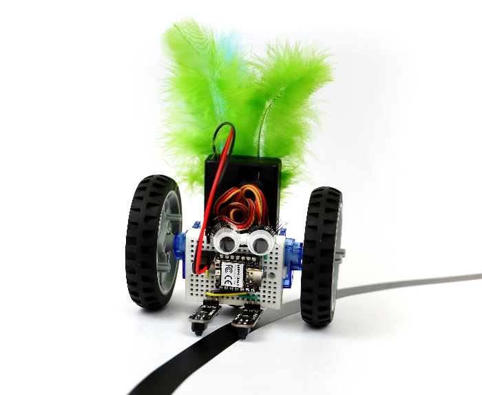

# MINT Line Follower Kit Example Code

This repository contains CircuitPython code examples, accompanying the educational "Line-Follow-Roboter" kit produced in collaboration with Kiludo and Google Switzerland for STEM ("MINT = Mathematik, Informatik und Technische Wissenschaften") workshops in Switzerland.

The kit is based on the [BreadboardBot](https://konstantint.github.io/BreadboardBot) project, which demonstrates more examples of the cool things you can try with your robot.

## Usage

The code comes preinstalled on the Xiao RP2040 microcontroller provided in the kit. In order to prepare a new microcontroller (or reset an existing one):

* Download the [CircuitPython 8 firmware](https://adafruit-circuit-python.s3.amazonaws.com/bin/seeeduino_xiao_rp2040/en_GB/adafruit-circuitpython-seeeduino_xiao_rp2040-en_GB-8.2.9.uf2).
* Hold the "BOOT" button on the Xiao RP2040 and while holding it connect it via USB to your computer. A new external drive named `RPI2-RP2` should appear. Copy the `.uf2` file downloaded in the previous step to this drive. When download completes, the microcontroller restarts and an external drive named `CIRCUITPY` should appear. You can read more about this flashing process [here](https://wiki.seeedstudio.com/XIAO-RP2040-with-CircuitPython/).
* Copy the contents of the `code` directory in this repository to the `CIRCUITPY` drive.

To build the kit, follow the instructions in the [Instruction Booklet (in German)](http://goo.gle/Anleitung_LineRoboter).

## License

* All original code in this repository is subject to the Apache License Version 2.0.
* The CircuitPython libraries distributed (in compiled form) in the `code/lib` directory were created by Adafruit and are MIT-licensed.

